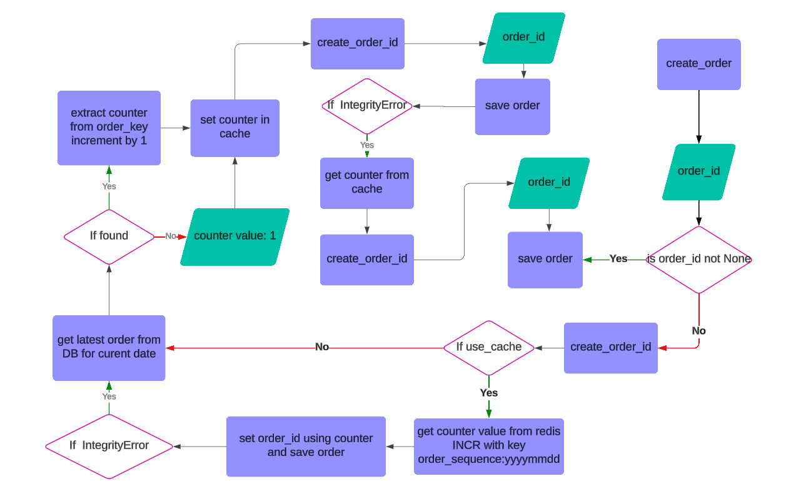

# OrdersHub

**A test project that processes online orders with high concurrent traffic**


## Problem
A webserver processing online orders with high concurrent traffic requires a unique order ID format: YYYYMMDD-nnnnn, where YYYYMMDD represents the date and nnnnn is a sequential number starting from 00001 each day. For examples:

- Order 1 for July 18, 2020: 20200718-00001
- Order 2 for July 18, 2020: 20200718-00002

There can be a possibility of collission (race condition) when same IDs can get assinged to two orders due to latency in serving requests.


## Proposed Solution
to prevent the collision and take care of the uniqueness of order_ids we can reduce the latency by caching the counter which reduces the request serving time and probability of havinig a collision. Redis allows atomic operations, which can guarantee that no two processes get the same sequential number for a given date, even under heavy traffic. This ensures no collisions between order IDs.


## Implementation

**Below is Algorithm Chart**




## Tech Stack
**Backend:** Django/Python

**Database:** Postgresql

**Libraries:**
- django-redis
- freezegun

**Services:**
- Redis

**Tools:**
- Docker


## Setup

- Start Server

    ``` bash
    make setup
    ```


## Test

- **UI Testing**

  We created a simple testing template to make 50 concurrent requests for order creation, that will show the order_ids of the orders getting created on hitting Create Orders button.
    1. Open url http://127.0.0.1:8000/
    2. Click on the button `Create Orders`
    3. Check Network tab and also verify on UI if orders are created


- **Unit Testing**
    ``` bash
    make runtests
    ```
